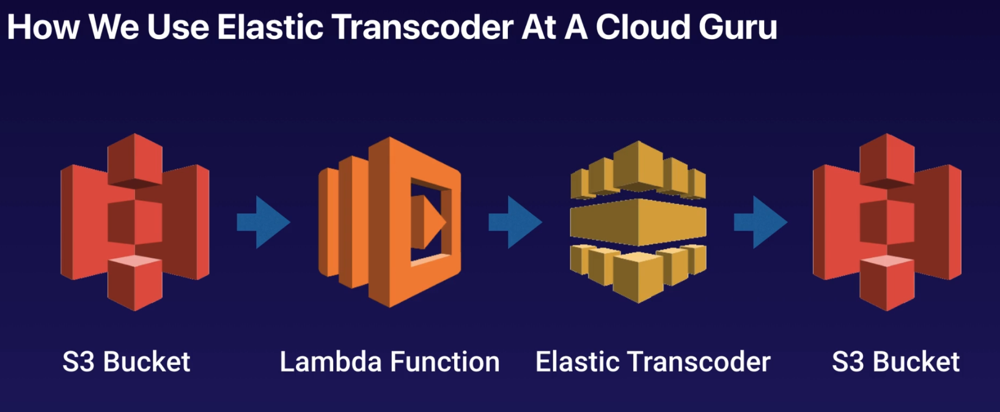
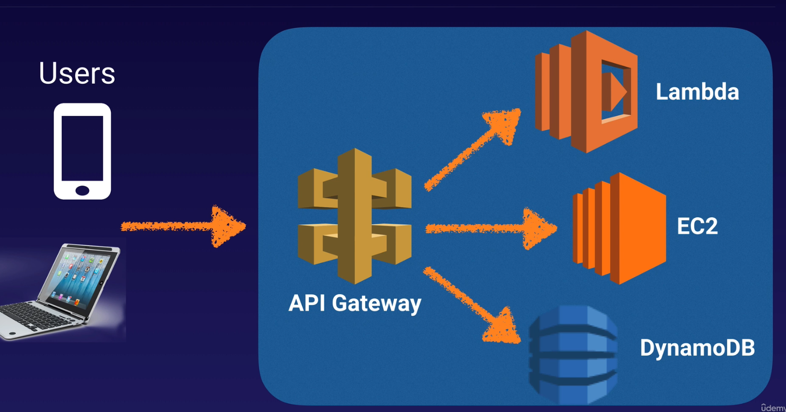
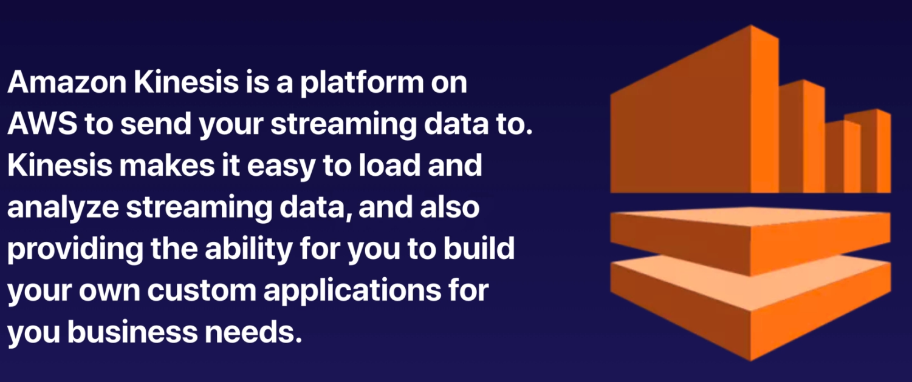
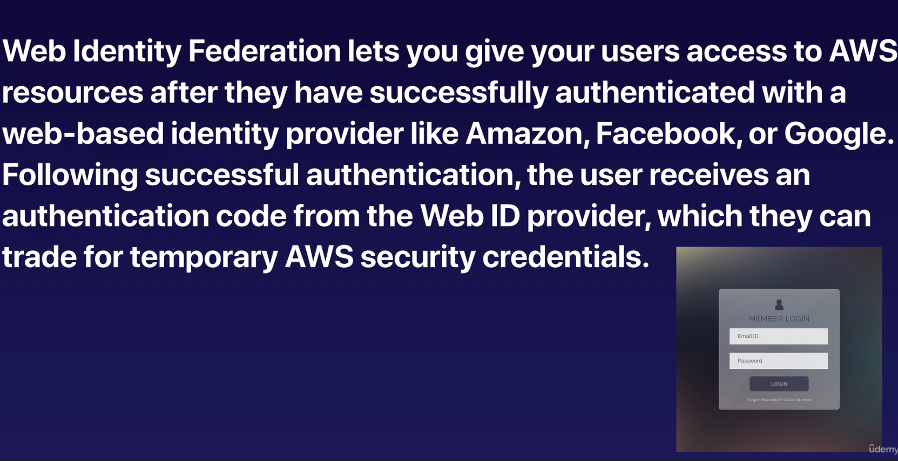

## SQS SAA-C02
Tip for exam:
- SQS is pull-based, not pushed-based
- Message are 256 KB in size
- Mess can be kept in the queue from 1 min to 14 days; default retention period is 4 days
- Visibility timeout is the amount of time that the message is invisible in the SQS queue after a reader picks up that
message. Provided the job is processed before the visibility time out expires, the message will then be deleted from
the queue. If the job is not processed within that time, the message will become visible again and another reader will
  process it. This could result in the same mess being delivered twice.
- Visibility timeout maximum is 12 hours
- SQS guarantees that your messages will be processed at least once
- Amazon SQS long polling is a way to retrieve message from your Amazon SQS queues. While the regular short polling return
immediately (even if the mess queue being polled is empty), long polling doesn't return a response util a mess
  arrives in the message queue, or the long poll times out
- Any time you see a scenario based question about "decoupling" your infra - think SQS

## SWF - Simple Workflow Service
### SWF vs SQS
- SQS has a retention period of up to 14 days; **with SWF, workflow executions can last up to 1 year**
- Amazon SWF presents a task-oriented API, SQS offers a message-oriented API
- SWF ensures that a task is assigned only once and is never duplicated. With SQS, u need handle duplicated mess and
may also need to ensure that a mess is processed only once
- SWF keeps track if all the tasks and events in an app. With SQS, u need to implement your own app-level tracking
especially if your app uses multiple queues

### SWF Actors
- Workflow Starters - An app that can initiate (start) a workflow. Could be your e-commerce web following the placement
of an order, or a mobile app searching for bus times
- Deciders - Control the flow of activity tasks in a workflow execution. If something has finished (or failed) in a 
workflow, a decider decides what to do next
- Activity Workers - carry out the activity tasks

## SNS - Simple Notification Service
### SNS benefit
- Instantaneous, push-based delivery (no polling)
- Simple APIs and easy integration with apps
- Flexible mess delivery over multiple transport protocols
- Inexpensive, pay-as-you-go model with no up-front costs
- Web-based AWS Management Console offers the simplicity of a point-and-click interface
### SNS vs SQS
- Both Message Services in AWS
- SNS - push
- SQS - polls (Pulls)

## Elastic Transcoder

What is?
- Media Transcoder in the cloud
- Convert media files from their original source format in to diff formats that will play on smartphones, tablets,...
- Provides transcoding presets for popular output formats, which means that u don't need to guess about which settings
work best on particular devices
- Pay based on the minutes that u transcode and the resolution at which you transcode

## API Gateway

Exam tip
- API gateway is at a high level
- API gateway has caching capabilities to increase performance
- API Gateway is low cost and scales automatically
- U can throttle API gateway to prevent attacks
- U can log results to CloudWatch
- If u are using JS/AJAX that use multiple domains with API Gateway, ensure that u have enabled CORS on API Gateway
- **CORS is enforced by the client**

## Kinesis [SAA-C02]

3 Types:
- Kinesis Streams
- Kinesis Firehose
- Kinesis Analytic

## Web Identity Federation - Cognito

Tip for exam
- Federation allows users to authen with a Web Identity Provider (Google, FB, Amazon)
- The user authen first with the Web ID provider and receives an authen token, which is exchanged for temporary
AWS credentials allowing them to assume an IAM role
- Cognito is an Identity Broker which handles interation between your app and the Web ID provider (U don't need 
  to write your own code to do this)
- User pool is user based. It handles things like user registration, authen and account recovery
- Identity pools authorise access to your AWS resource

