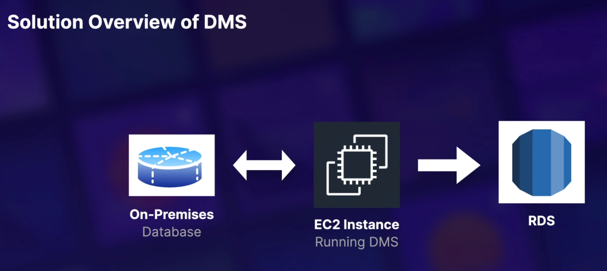
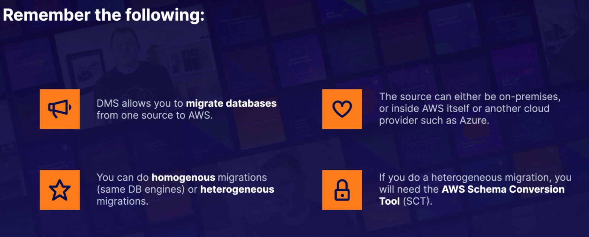
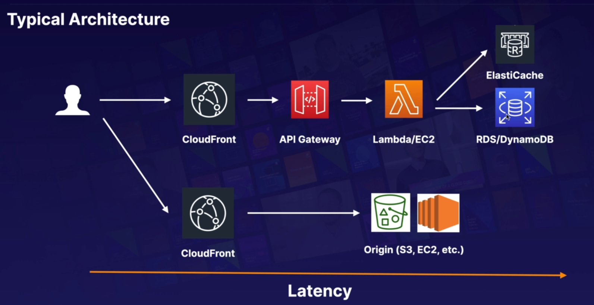
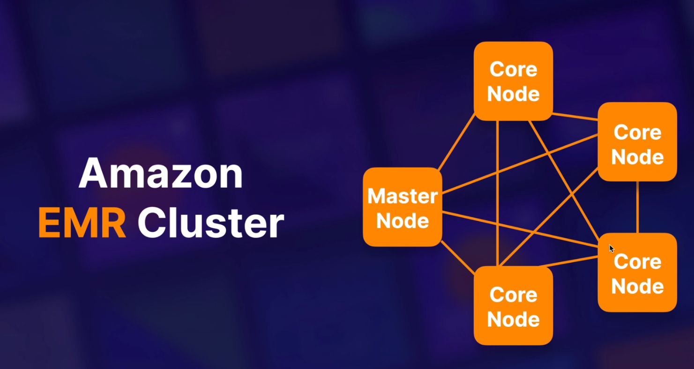
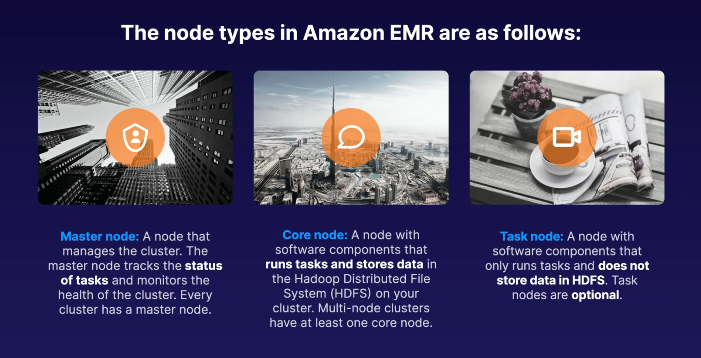
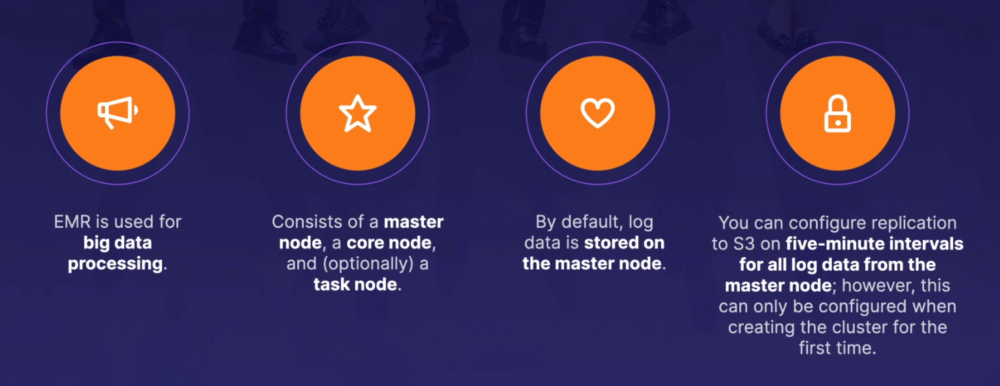

# Database 101

## Overview
### RDS (OLTP) includes 6 types:
- SQL
- MySQL
- Postgres
- Oracle
- Aurora
- MariaDB

### DynamoDB (No SQL)

### **Red Shift OLAP** is AWS data warehouse solution or Business Intelligence

### Elasticache includes Memcached and Redis

### IOPS = input/output operations per second

## Relational Databases
- RDS runs on virtual machines
- Can not log in to these operating systems
- Patching of the RDS Operating System and DB is Amazon's responsibility
- RDS is NOT Serverless
- Aurora Serverless is Serverless

## RDS Backups, Multi-AZ & Read Replicas
**Read Replicas** available for the following DB:
- Mysql server
- Postgresql
- MariaDB
- Oracle
- Aurora

Things to know ab **Read Replicas**:
- Used for scaling, not for DR
- Must have auto backup turn on in order to deploy a read replica
- Have up to 5 read replica copies of any DB
- Have read replicas of read replicas
- Each RR will have its own DNS endpoint
- Can have RR that have multi-AZ
- Can create RR of Multi-AZ source DB
- RR can be promoted to be their own DB. This breaks the replication
- Can have a RR in a second region

There are two diff types of backups for RDS:
- Automated Backups
- Databases Snapshots

> Encryption at rest is supported for Mysql, Oracle, SQL server, Postgres, MariaDB and Aurora.
> Encryption is done using the AWS KMS service. One your RDS instance is encrypted, the data stored
> ar rest in the underlying storage is encrypted, as are its auto backups, read replicas and 
> snapshot

## Dynamo DB
The basics are as follows:
- Stored in SSD storage
- Spread across 3 geographically distint data centres
- Eventual Consistent Reads (Default)
- Strongly Consistent Reads

### DynamoDB Accelerator - DAX

## Redshift
- Is used for business intelligence
- Available in only 1 AZ
Backup
- Enable by default with 1 day retention period
- Max retention period is 35 days
- Always attempts to maintain at least 3 copies of your data ( original, replica on the compute
  nodes, a backup in Amazon S3)
- Can also async replocate your snapshot to S3 in another region for disaster recovery

## Aurora
Things to know
- Start with 10GB, scales in 10GB increments to 64 GB
- Compute resources can scale up to 32vCPUs and 244GB of Memory
- 2 copies of your data is contained in each avai zone, with min of 3 avai zones. 6 copies of your
data
- can share Aurora Snapshots with other AWS acc
- 3 types of replicas avai. Aurora Replicas, Mysql replicas and Postgres replicas. Auto
failover is only available with Aurora Replicas
- Aurora has auto backups turn on by default. You can also take snapshot with Aurora. U can
share these snapshot with other AWS acc
- use Aurora serverless if want a simple, cost-effective option for infrequent, intermittent 
or unpredictable workloads
  
## Elasticache
Includes **Memcached** and **Redis**
Tip of the exam:
- Elasticache increase database and web app performance
- Memcached is limit of object type than Redis
- Redis is multi-AZ
- Can backup and restore of Redis

## Database Migration Services (DMS)

DMS = Databases Migration Service  
SCT = Schema Convertion Tool

## Caching Strategies on AWS

Caching is a balancing act between up-to-date, accurate information and latency. We can use
the following services to cache on AWS:
- CloudFront
- API Gateway
- ElasticCache - Memcached and Redis
- DynamoDB Accelerator (DAX)

## EMR Overview

> The central component of Amazon EMR is the cluster. A cluster is a collection of Amazon
> Elastic Compute Cloud (Amazon EC2) instances. Each instance in the cluster is called a 
> node. Each node has a role within the cluster, referred to as the node type

If master node is shutdown or terminated, we lose all log data. So we need config a cluster
to archive the log files stored on the master node to Amazon S3. Amazon EMR archives the log
files to Amazon S3 at five-minute intervals

**EMR Tip of the Exam**
