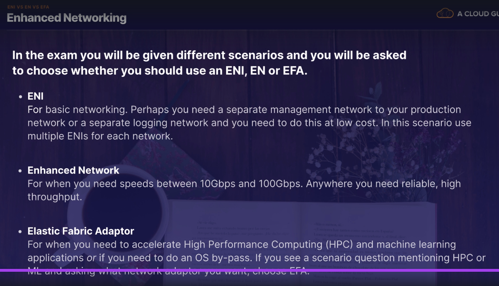
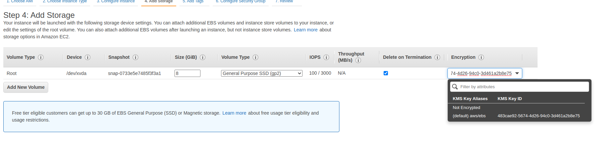
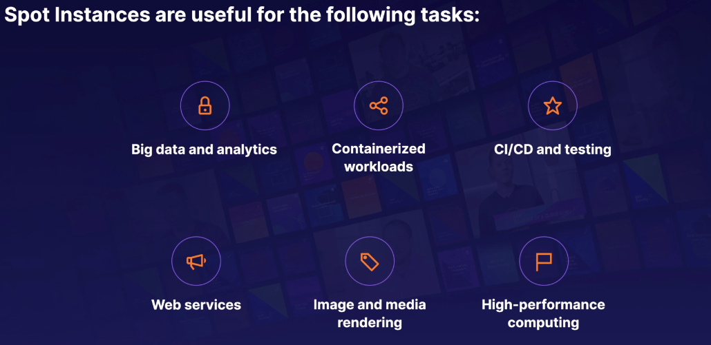
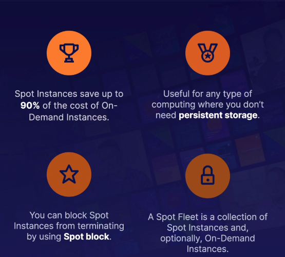
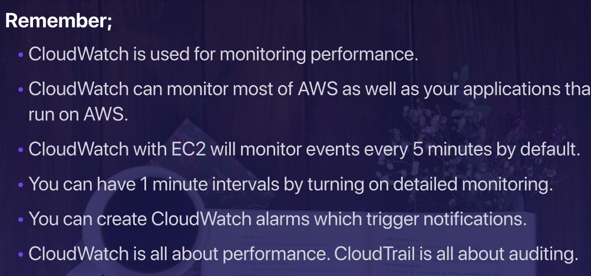

# EC2

## Overview
### 4 types of payment in EC2
- On Demand
- Reserved: like contract in 1-3 years
- Spot: bid whatever you want for instance capacity
- Dedicated Host: Physical EC2 server for your use
> If the Spot instance is terminated by EC2, you will not be charged for a partial hour of 
> usage. But if you terminate the instance yourself, u will be charged for any hour in which
> the instance ran

### Type of EC2 Instance 


## Let your hand dirty =))
After launch an instance, you will log in to it from your computer
- Download file .pem to computer
- Copy .pem to .ssh/ and chmod 400
- Connect by command
```
$ ssh ec2-user@101.152.124.21 -i .ssh/yourFile.pem
```


You can use connect CLI version web, it is provided by AWS


Note:  
- Default action for the root EBS volume to be deleted when instance terminated

## Security Group - Basic
- All inbound traffic is blocked by default
- All outbound traffic is allowed
- When change rule in Security Group, change will approve immediately
- Relationship of **EC2 instance** and **Security Group** is n-n
- Can't block specific IP address by Security Group, instead use Network Access Control List
- Can specific allow rules, but not deny rules

## EBS 101


5 types of EBS Storage
- General Purpose
- Provisioned IOPS
- Throughput Optimised Hard Disk Drive
- Cold hard Disk Drive
- Magnetic


## EBS Volume and Snapshots

- Volumes exists on EBS. It likes virtual Hard disk
- Snapshots exists on S3. It likes photograph of the disk
- Snapshots is a point in time copies of Volumes
- If this is your first snapshot, it may take sometime to create
- To create a snapshot for Amazon EBS volumes that serve as root devices, should stop 
instance before create snapshot
- Can take snapshot while instance is running
- Can create AMI (Image) from snapshot
- Can change EBS volume size in the fly, includes change size and storage type
- EBS Volume always in the same AZ
- To move an EC2 volume from one AZ to another: Take a snapshot > create an AMI > use AMI to launch
instance in new AZ
- To move an EC2 volume from one Region to another: Take a snapshot > create an AMI > Copy 
  AMI to Region > use AMI to launch instance in new AZ
  
## AMI Types - EBS vs Instance Store
We can go to Amazon Instance Store and create Instance from AMI in that
- Instance Store sometime called Ephemeral Storage because we lose data when instance terminated
- Instance Store volumes can't be stopped. If host fails, we lose data
- EBS backed instance can be stopped. We not lose data
- Can reboot both, and will not lose data
- Default, root volume will be deleted when terminated. However with EBS volume, u can tell
AWS keep the root device volume

## ENI vs ENA vs EFA
#### ENI
Elastic Network Interface
#### EN
Enhanced Networking
#### EFA - Elastic Fabric Adapter



## Encrypted Root Device, Volumes and Snapshots


To create Snapshots and AMI from an unencrypted Volume > create unencrypted Snapshot > copy
snapshot with chosen encrypted > Create encrypted AMI from Copied Snapshot

- Snapshot of encrypted volumes are encrypted automatically
- Volumes restore from encrypted Snapshot are encrypted automatically
- Can share snapshot when it is unencrypted

## Spot Instances & Spot Fleets
### Spot Instance good for:

### Spot Instance not good for:
- Persitent Workload
- Critical Jobs
- Databases
### Notice


## EC2 Hibernate
Hibernate good for:
- Long-running process
- Service that take time to initialize

Tip for Exam:
- EC2 Hibernate preserves the in-memory RAM on persistent storage
- Faster to boot up because not need reload the OS
- Instance RAM must < 150GB
- Instance families includes C3, C4, C5, M3, M4, M5, R3, R4, R5
- Available for Windown, Amazon Linux 2AMI, Ubuntu
- Can't hibernate over 60 days
- Available for On-demand Instance and Reserved Instance

## CloudWatch 101
Diff of CloudWatch and CloudTrail
- CloudWatch monitor performance
- CloudTrail monitors API call in the AWS platform



**What can do with CloudWatch:**
- Create Dashboard to monitor what happening with AWS environment
- Alarms - Allow to set alarms to notify to system admin
- Events - help to respone to stage change in AWS resource
- Logs - help aggregate, monitor and store logs

## AWS Command Line
CLI to use with aws
```
$ aws s3 ls
$ aws configure
$ aws s3 ls
$ aws s3 mb s3://longblogtestcreatefromlondon
$ aws s3 ls
```

Tip for exam:
- Can interact with AWS from anywhere in the world just using CLI
- Will need setup access in IAM

## Using IAM Roles With EC2
- Role safely than storing access key and secret key in EC2 instance
- Roles can assigned to en EC2 instance after it is created using both the console & command live

