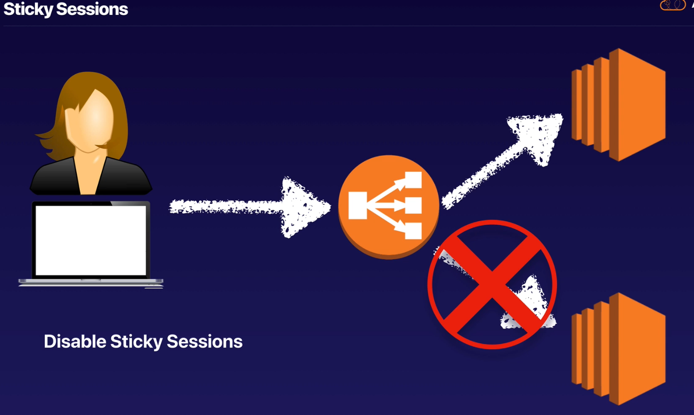
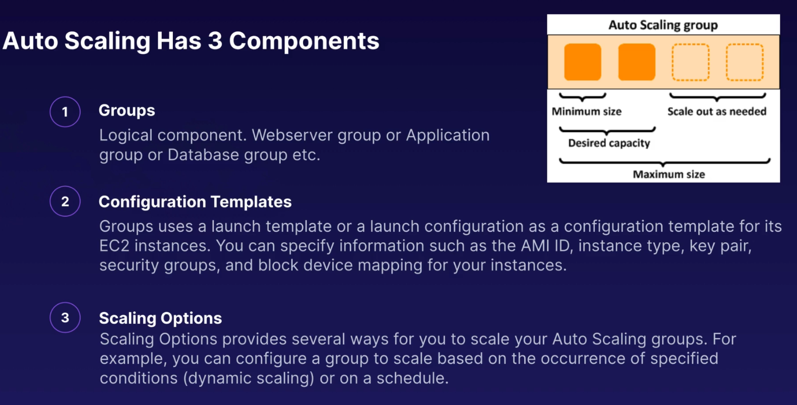

## Load Balancers Theory
3 Different Types of Load Balancers:
- Application Load Balancer
- Network Load Balancer
- Classic Load Balancer - cost down

- 504 Error mean gateway has time out. Application not response within the idle timeout period
- Trouble shoot the app. Is it the web server or DB

- If need IPv4 of end user, look for X-Forwarded-For header

## Load Balancers Labs
- Instance monitor by ELB are reported as ; InService/OutOfService
- Healthcheck check instance health by talking to it
- Load Balances have their own DNS name. You never given an IP add
- Read the ELB FAQ for Classic LB

## Advanced Load Balancer Theory
**Sticky Session**

Tip for exam:
- Sticky Session enable your users to stick to the same EC2 instance. Can be useful if you storing
information locally instance
- Cross Zone LB enable you to load balance across multiple AZ
- Path patterns allow you to direct traffic to difference EC2 instances based on the URL contained
in the request

## Autoscaling Theory

Scaling Option:
- Maintain current instance levels at all time
- Scale manually
- Scale based on a schedule
- Scale based on demand
- Use predictive scaling

## Autoscaling Groups - Lab
Create Autoscaling group from menu EC2 instance, by setup, it auto create instance and auto 
initial new instance if have any old instance is shutdown

## HA Architecture
Tip for exam:
- Always design for failure
- Use Multiple AZ and Multiple Regions where ever you can
- Know the diff between multi-AZ and Read Replicas for RDS
- Know the diff between scaling out and scaling up
- Read question carefully and always consider the cost element
- Know the diff S3 storage classes

## HA Word Press Site

