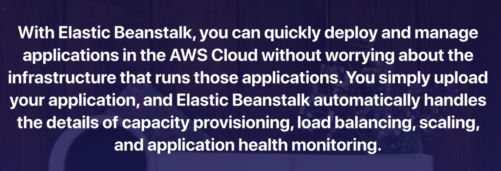

## Load Balancers Theory
3 Different Types of Load Balancers:
- Application Load Balancer
- Network Load Balancer
- Classic Load Balancer - cost down

- 504 Error mean gateway has time out. Application not response within the idle timeout period
- Trouble shoot the app. Is it the web server or DB

- If need IPv4 of end user, look for X-Forwarded-For header

## Load Balancers Labs
- Instance monitor by ELB are reported as ; InService/OutOfService
- Healthcheck check instance health by talking to it
- Load Balances have their own DNS name. You never given an IP add
- Read the ELB FAQ for Classic LB

## Advanced Load Balancer Theory
**Sticky Session**

Tip for exam:
- Sticky Session enable your users to stick to the same EC2 instance. Can be useful if you storing
information locally instance
- Cross Zone LB enable you to load balance across multiple AZ
- Path patterns allow you to direct traffic to difference EC2 instances based on the URL contained
in the request

## Autoscaling Theory

Scaling Option:
- Maintain current instance levels at all time
- Scale manually
- Scale based on a schedule
- Scale based on demand
- Use predictive scaling

## Autoscaling Groups - Lab
Create Autoscaling group from menu EC2 instance, by setup, it auto create instance and auto 
initial new instance if have any old instance is shutdown

## HA Architecture
Tip for exam:
- Always design for failure
- Use Multiple AZ and Multiple Regions where ever you can
- Know the diff between multi-AZ and Read Replicas for RDS
- Know the diff between scaling out and scaling up
- Read question carefully and always consider the cost element
- Know the diff S3 storage classes

## HA Word Press Site

## CloudFormation
Tip for exam
- Is a way of completely scripting your cloud env
- Quick Start is a bunch of CloudFormation templates already built by AWS Solution Architects allowing you to create
complex env very quickly
  
## Elastic Beanstalk

## Highly Available Bastions - SAA-C02
We have 2 scenario for Bastion Host
- Use Network Load Balancer
- Use Auto Scaling Group

Tip for exam:
- 2 host in 2 separate AZ. Use a Network LB with static IP add and healthcheck to fail over one host to the other
- Can't use an Application Load Balancer, as it is layer 7, and u need use layer 4
- One host in one AZ behind an Auto Scaling Group with heath checks and a fixed EIP. It is cheapest option, but it
not 100% fault tolerant
  
## On Premise Strategies - SAA-C02
- Database Migration Service (DMS)
- Server Migration Service (SMS)
- AWS Application Discovery Service
- VM Import/Export
- Download Amazion Linux 2 as an ISO

