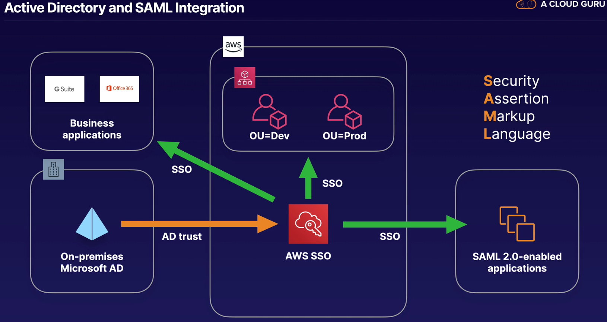

# IAM

## IAM Policies
**ARNs (Amazon Resource Name)** begin with:  
`arn:partition:service:region:account_id`

ARN end with:
- resource
- resource_type/resource
- resource_type/resource/qualifier
- resource_type/resource:qualifier
- resource_type:resource
- resource_type:resource:qualifier

Example

Tip for exam:
- Not explicitly allowed = denied
- Explicit deny > everything else
- Only attached policies have effect
- AWS join all applicable policies
- **Permission boundary**: Set a permissions boundary to control the **maximum** permissions
  this user can have. For exam: User with AdministratorAccess policy but have permissions boundary
  AmazonDynamoDBFullAccess => That User only access to DynamoDB in spite of Admin permission
  
## Resource Access Management (RAM)
RAM help share resource from account A to account B like: share DB of account A to account B

## AWS Single Sign-On
Tip of exam
- Centrally manage access
- Example: GSuite, Office 365, Salesforce
- Use existing identities
- Account-level permission
- SAML = Security Assertion Markup Language

