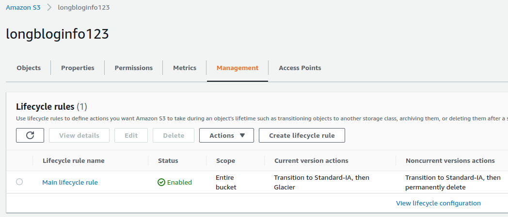
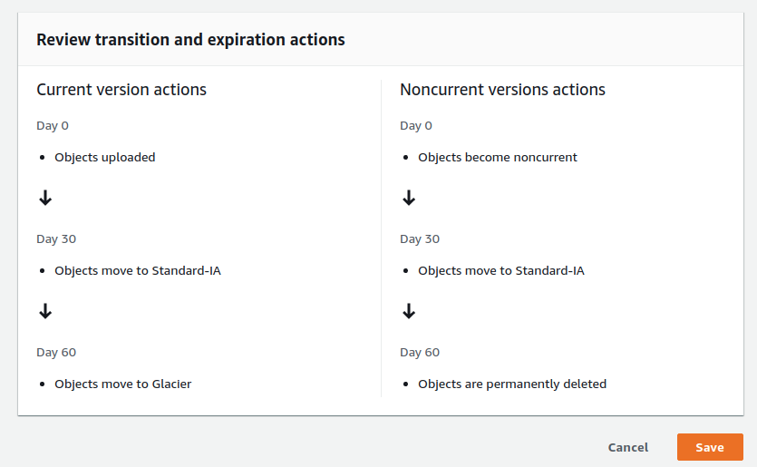
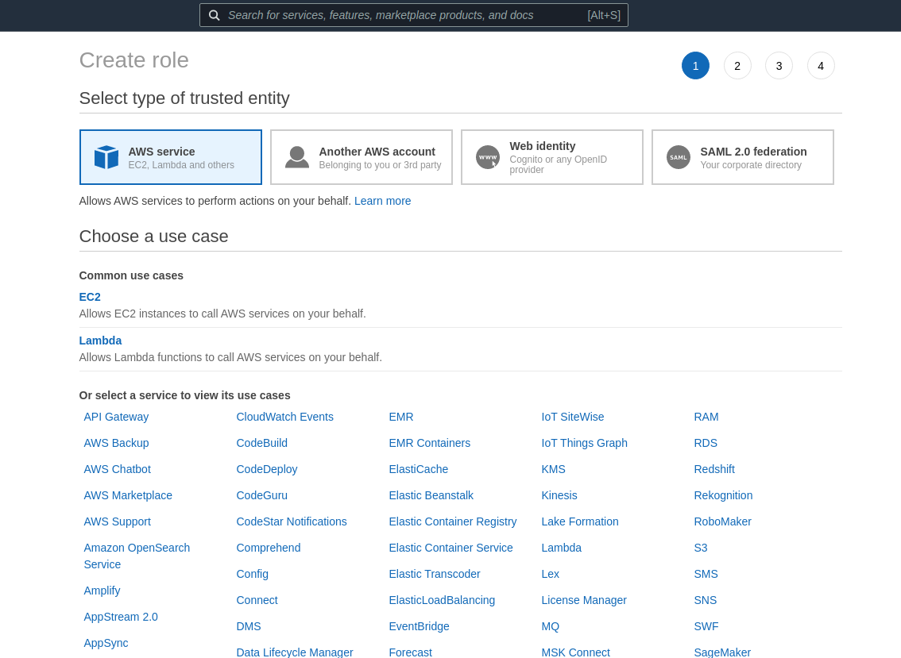
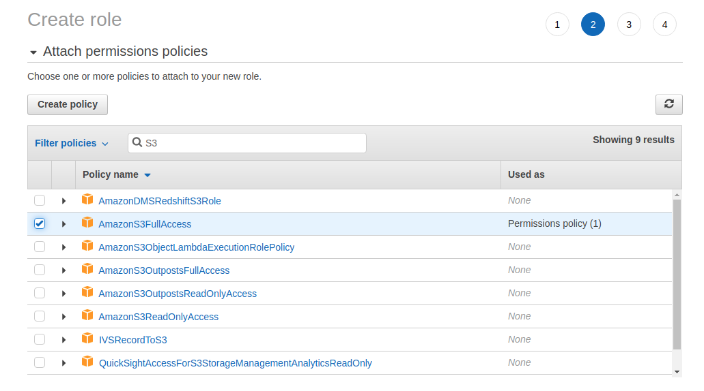
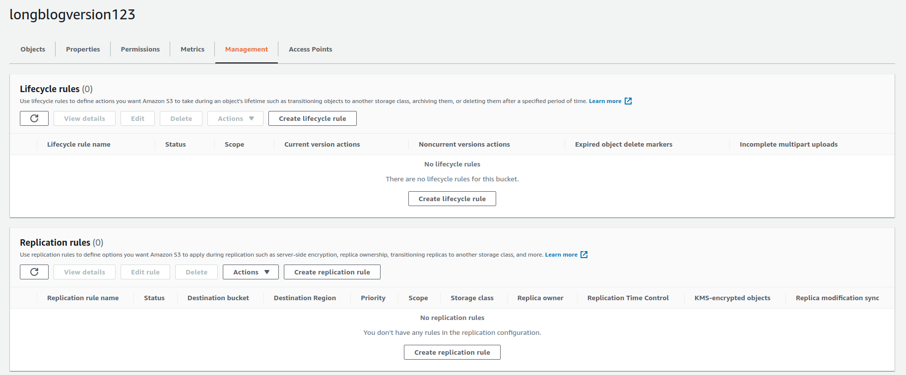
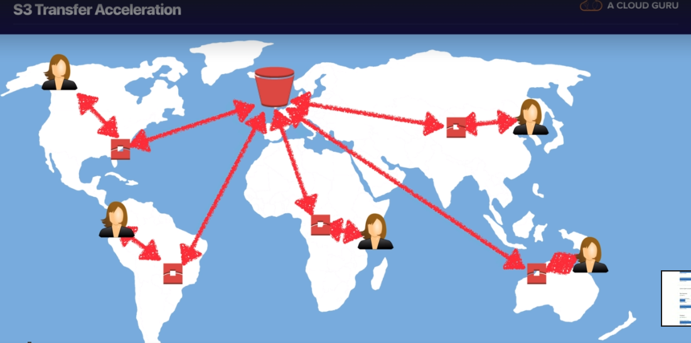
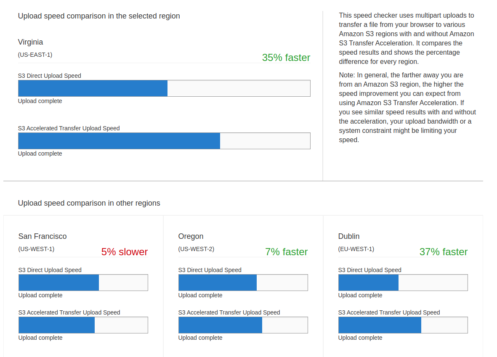

# S3

## Lifecycle
Go to Management to create lifecycle rule

We can review and see action of lifecycle

## S3 Object Lock & Governance Mode
- Use S3 Obj Lock to storage objects using a write one, read many (WORM)  
- Use S3 Obj Lock to meet regulatory requirements that required WORM storage    

> **Governance mode**, users can't overwrite or delete
> an object version or alter its lock settings, unless they have special permission
> With governance mode, you can protect object against being deleted by most user, but
> you can still grant some users permission to alter the retention setting or delete obj
> if necessary

> **Compliance Mode**: protected obj version can't be overwritten or delete by any user, **include 
> root user**. When an obj looked in compliance mode, its retention mode can't be change

> **Retention Period**  
> A retention period protects an obj version for a fixed amount of time. When place a retention period, S3 
> save obj version with timestamp, and after expires, obj version can be overwritten or delete

> **Legal holds**  
> S3 Obj Lock also enables you to place a legal hold on an object. Legal hold protects an obj version from 
> overwritten or delete. But root user or any user with permission s3:PutObjectLegalHold can remove
> legal hold

S3 Glacier Vault Lock

## S3 Performance
Create S3 with more source (/) can increase performance.
Imagine: A bucket with path S3:/long_blog/today/morning have more speed loading than a bucket with path S3:/long_blog/today

## S3 Select and Glacier Select

## AWS Organization

## Sharing S3 between Account
Go to IAM > Role > Create Role

Click Another AWS account > add Account ID > Next > Create Role > Choose AmazonS3FullAccess

3 ways to share S3 bucket across account:
- Using bucket Policies and IAM
- Using bucket ACLs & IAM
- Cross Account IAM Roles. Programmatic AND Console Access

## S3 Cross Region Replication
Create new bucket in another Region  
Go to Source Bucket > Management > Replication rules

- Versioning must enable on both the source and destination buckets
- Old object in source bucket will not sync to replication bucket. Object create new or update in source bucket 
will start sync to replication. That means, old version of an object won't sync in new replication bucket.
- Make public an object in source bucket don't make public that object in replication bucket
- Delete marker or Delete a Delete marker are not replicates
- Understand what Cross Region Replication is at a high level

## Transfer Acceleration

User upload file to Transfer Acceleration. After that, that file will transfer to backbone of S3.  
We can go to http://s3-accelerate-speedtest.s3-accelerate.amazonaws.com/en/accelerate-speed-comparsion.html to compare speed to upload file
depend on Region

## AWS DataSync
