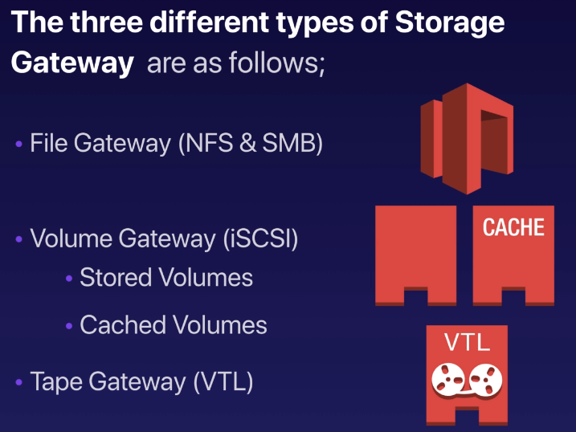
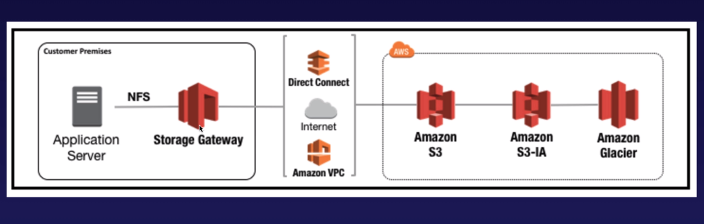

# Storage Gateway

## Overview

- **File Gateway**: For flat files, stored directly on S3
- **Volume Gateway**:
    - Store volume: Entire Dataset stored on site and is asynchronously backed up to S3
    - Cached Volume:  Entire Dataset stored on S3 and the most frequently accessed data
      is cached on site