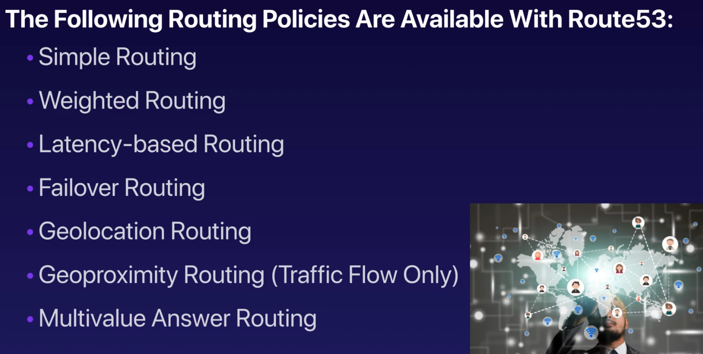
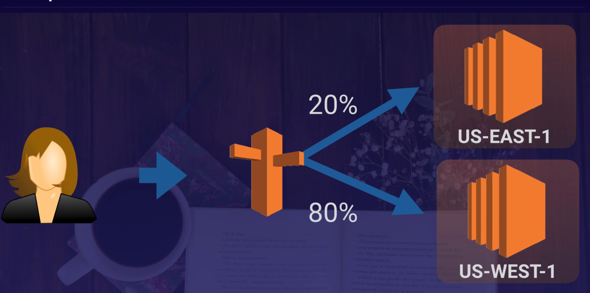
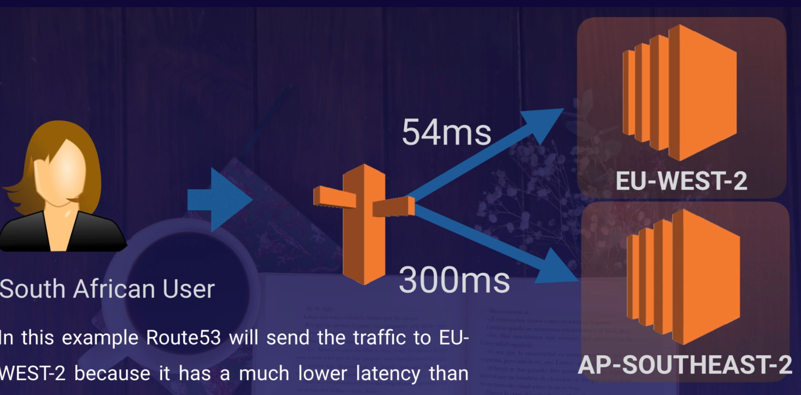
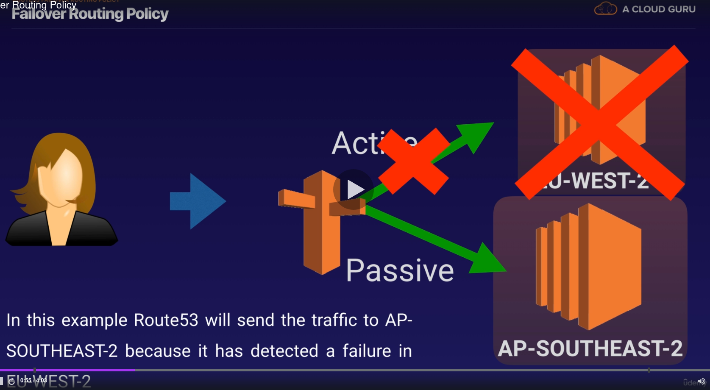
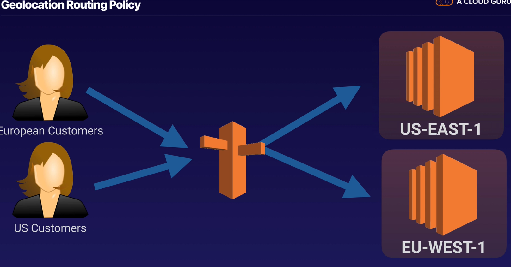

# Route 53

## DNS 101
Tip for Exam
- Elastic Load Balancer - EBL don't have pre-define IPv4 address; you resolve to them using
a DNS name
- understand diff between Alias Record and CNAME
- Given the choice, always choose an Alias Record over a CNAME

**Common DNS Types**
- SOA Records
- NS Records
- A Records
- CNAMES
- MX Records - for mail
- PTR Records

## Route53 - Register A Domain Name
- Can buy domain names directly with AWS
- Take up 3 day to register

## Route53 Routing Policies Available On AWS

## Simple Routing
- if choose: you can only have one record with mutiple IP address
- if have multiple value in a record, Route 53 return all values to the user in a random order
Type = SOA

## Weighted Routing Policy
Set percentage traffic in to different IP address by set weight for each IP address

Heath Check
- Can set heath check on individual record sets
- If a record set fails a health check it will be removed from Route53 util it pass the health check
- Can set SNS noti to alert if a heath check fail

## Latency Routing
Allow to route traffic based on the lowest latency

## Failover Routing
Send traffic to passive IP address

## Geolocation Routing
Route request to IP address depends on Geolocation of customer request

## Geoproximity Routing
To use Geoproximity routing, must use Route 53 traffic flow

Go to Traffic Policies > Create Traffic policy

## Multivalue Answer Routing
It like Simple Routing but add Health Check before routing

