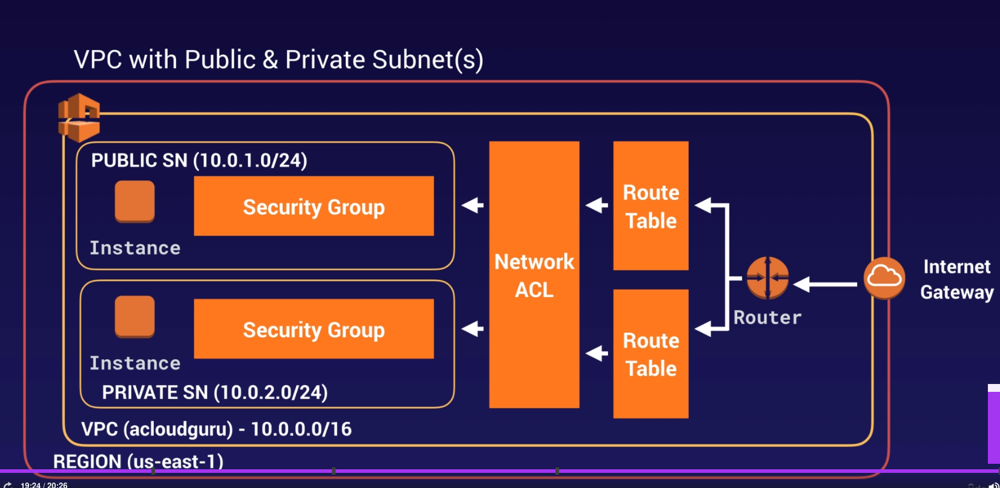

# VPC

## Overview
VPC = Virtual Private Cloud

Tip for exam
- VPC like a logical datacenter in AWS
- Consists of IGW - Virtual Private Gateways, Route Tables, Network Access Control List - NACL,
Subnet & Security Group
- 1 Subnet = 1 AZ
- Security Gr are Stateful, NACL are stateless
- NO TRANSITIVE PEERING

## Create VPC

Tip for exam:
- When create a VPC, AWS also create a default Route Table, NACL and a default Security Group
- When create a VPC, won't create any subnet, and not create default Internet Gateway
- AZ for choosen is random for each account
- AWS always reserve 5 IP address in your subnet
- Can have only 1 Gateway per VPC
- Security Group can't span VPCs

## Network Address Translation (NAT)
Tip:

**NAT INSTANCE**
- When create a NAT instance, Disable Source/Destination Check on Instance
- NAT instance mus be in a public subnet
- There must be a route out of the private subnet to the NAT instance, on order for this to Work
- Amount of traffic that support by NAT instance depend instance size. If bottlenecking, increase
instance size
- Can create high avai using Autoscaling Groups. multiple subnets in diff AZs, and a script
to auto failover
- NAT behind Security Group

**NAT GATEWAY**
- Redundant inside the AZ
- Preferred by the enterprise
- Starts at 5Gbps and scales currently to 45Gbps
- No need to patch
- Not associated with security group
- Auto assigned a public IP address
- Remember to update your route table
- No need disable Source/Destination Checks

## Network ACL
