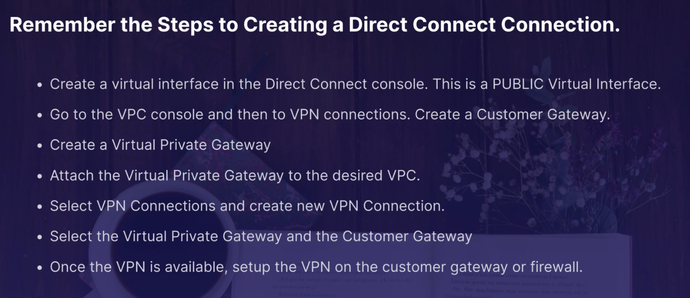

# VPC

## Overview
VPC = Virtual Private Cloud

Tip for exam
- VPC like a logical datacenter in AWS
- Consists of IGW - Virtual Private Gateways, Route Tables, Network Access Control List - NACL,
Subnet & Security Group
- 1 Subnet = 1 AZ
- Security Gr are Stateful, NACL are stateless
- NO TRANSITIVE PEERING

## Create VPC

Tip for exam:
- When create a VPC, AWS also create a default Route Table, NACL and a default Security Group
- When create a VPC, won't create any subnet, and not create default Internet Gateway
- AZ for chosen is random for each account
- AWS always reserve 5 IP address in your subnet
- Can have only 1 Internet Gateway per VPC
- Security Group can't span VPCs
- By default, **5 VPCs** am I allowed in each AWS region

## Network Address Translation (NAT)
Tip:

**NAT INSTANCE**
- When create a NAT instance, Disable Source/Destination Check on Instance
- NAT instance mus be in a public subnet
- There must be a route out of the private subnet to the NAT instance, on order for this to Work
- Amount of traffic that support by NAT instance depend instance size. If bottlenecking, increase
instance size
- Can create high avai using Autoscaling Groups. multiple subnets in diff AZs, and a script
to auto failover
- NAT behind Security Group

**NAT GATEWAY**
- Redundant inside the AZ
- Preferred by the enterprise
- Starts at 5Gbps and scales currently to 45Gbps
- No need to patch
- Not associated with security group
- Auto assigned a public IP address
- Remember to update your route table
- No need disable Source/Destination Checks

## Network ACL

**Tip for exam**
- VPC auto comes with default network ACL, and default allow all inbound + outbound traffic
- Can create custom network ACLs. Default, each custom network denies all inbound and outbound unti
add rules
- Each subnet in VPC must be associated with a network ACL. If don't explicitly associate a subnet
with a network ACL, the subnet is auto associated with default network ACL
- Block IP addr using ACLs not Security Groups
- Can associate a network ACL with multiple subnets. A subnet can be associated with only 1 network
ACL at a time. When associated a network ACL with a subnet, previous association is removed
- Network ACL contain a numbered list of rules that is evaluated in order, starting with the
lowest numbered rule
- NACL have separate inbound and outbound rules, and each rule can either allow or deny traffic
- NACL are **stateless**; response to allowed inbound traffic are subject to the rules for outbound
traffic
  
## Load Balancer
An application load balancer must be deployed into **at least two subnets**.

## VPC flow logs
Flow logs can create at 3 levels:
- VPC
- Subnet
- Network Interface Level

Remember
- Can't enable flow logs for VPCs that are peered with your VPC unless the peer VPC is in your acc
- Can tag flow logs
- After create flow log, cannot change its config; for example, can't associate a diff IAM role with the
flow log
- Not all IP Traffic is monitor
    - Traffic gen by instance when contact Amazon DNS server. If you use own DNS server, then all traffic to
    that DNS server is logged
    - Traffic gen by Windown instance for Amazon Windowns license
    - Traffic to and from 169.254.169.254 for instance metadata
    - DHCP traffic
    - Traffic to reserved IP add for the default VPC router
    
## Bastions

## Direct Connect

Step to creating a Direct Connect Connection

## Global Accelerator SSA-CO2
Global Accelerator includes:
- Static IP add
- Accelerator
- DNS name
- Network Zone
- Listener
- Endpoint Group
- Endpoint

## VPC End Points SSA-CO2

There are two types of VPC endpoints:
- Interface Endpoint
- Gateway Endpoint
  - Currently Gw Endpoint support: Amazon S3 & DynamoDB

## VPC Private Link SSA-CO2

Tip for exam:
- if see a question ask about peering VPC to 10, 100 or 1000 of customer VPCS, think AWS Private Link
- Not required VPC peering; no route table, NAT, IGW, ...
- Required Network Load Balancer on service VPC and an ENI on the customer VPC

## Transit Gateway SSA-CO2

 Tip for exam:
- Allow have transitive peering between thousands of VPCs and on-premises data centers
- Work on a hub-and-spoke model
- Works on a regional basis, but can have it across multiple region
- Can use it across multi AWS acc using Resource Access Manager RAM
- Can use route tables to limit how VPCs task to one another
- Work with Direct Connect as well as VPN connections
- Support **IP multicast** (not support by any other AWS service)

## VPN CloudHub

Tip for exam:
- If have multiple sites, each with its own VPN connection, can use AWS VPN cloud hub to connect those sites together
- Hub-and-spoke model
- Low cost; easy to manage
- It operates over the public internet but traffic from customer to the AWS VPN CloudHub is encrypted

## Networking Costs on AWS SSA-CO2
- Use private IP address over public IP add to save on costs. This them utilizes the AWS backbone network
- If want to cut all network costs, group your EC2 instances in the same AZ and use private IP add. This will
be cost-free, but make sure keep in mind single point of failure issues
  

